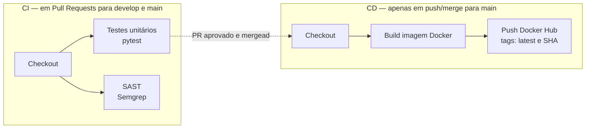

# CloudOps API — Pipeline CI/CD Completo


API REST simples em **FastAPI**, com um pipeline de CI/CD completo em **GitHub Actions**: testes unitários, análise de segurança estática (SAST) com **Semgrep**, build de imagem **Docker** e publicação automática no **Docker Hub**, seguindo o fluxo de branching **GitFlow**.

## Endpoints

| Método | Rota      | Descrição                          |
|--------|-----------|-------------------------------------|
| GET    | `/`       | Mensagem de saudação e status da API |
| GET    | `/health` | Health check da aplicação            |

## Como executar localmente

### Sem Docker

```bash
python -m venv .venv
.venv\Scripts\activate          # Windows
# source .venv/bin/activate     # Linux/macOS

pip install -r requirements.txt
uvicorn app.main:app --host 0.0.0.0 --port 8000
```

A API fica disponível em `http://localhost:8000`.

### Rodando os testes

```bash
pytest tests/ -v
```

### Com Docker

```bash
docker build -t cloudops-api .
docker run -p 8000:8000 cloudops-api
```

## Pipeline CI/CD



- **CI** (`.github/workflows/ci.yml`): disparado em todo Pull Request para `develop` ou `main`.
  - Job `test`: instala dependências e roda `pytest tests/ -v`. Se algum teste falhar, o pipeline falha e bloqueia o merge.
  - Job `sast`: roda o **Semgrep** com os rulesets `p/python` e `p/security-audit`. Os findings aparecem nos logs do job e também são publicados na aba **Security > Code scanning** do repositório. Não bloqueia o merge — é um gate informativo.
- **CD** (`.github/workflows/cd.yml`): disparado apenas em `push` na branch `main` (ou seja, só após um PR ser mergeado em `main`).
  - Builda a imagem Docker e publica no Docker Hub com duas tags: `latest` e o SHA do commit.

## Estratégia de branching (GitFlow)

- `main` — código de produção, branch protegida (exige PR + CI passando).
- `develop` — branch de integração das features.
- `feature/*` — desenvolvimento de novas funcionalidades, sempre a partir de `develop`.

Fluxo usado neste repositório: `feature/ci-cd-pipeline` → PR → `develop` → PR → `main`.

## Secrets necessários (GitHub Actions)

Configurados em *Settings > Secrets and variables > Actions*:

| Secret               | Descrição                                  |
|-----------------------|---------------------------------------------|
| `DOCKERHUB_USERNAME`  | Usuário da conta no Docker Hub               |
| `DOCKERHUB_TOKEN`     | Access Token do Docker Hub (não a senha)     |

Nenhuma credencial fica exposta no código ou nos logs — o login no Docker Hub é feito via `docker/login-action` consumindo esses secrets diretamente do GitHub.

## Stack

- [FastAPI](https://fastapi.tiangolo.com/) + [Uvicorn](https://www.uvicorn.org/)
- [Pytest](https://docs.pytest.org/) para testes unitários
- [Semgrep](https://semgrep.dev/) para SAST
- [Docker](https://www.docker.com/) para containerização
- [GitHub Actions](https://docs.github.com/en/actions) para CI/CD
