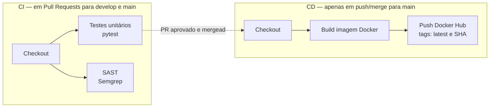

<p align="center">
  
</p>

<h1 align="center">🚀 Desafio 1 — Pipeline CI/CD Completo</h1>
<p align="center">
  API em <strong>FastAPI</strong> usada como base para construir um pipeline de CI/CD "nível produção" com <strong>GitHub Actions</strong>: testes automatizados, análise de segurança estática (SAST), build e publicação de imagem Docker, seguindo o fluxo <strong>GitFlow</strong>.
</p>

<p align="center">
  
  
</p>

## 🛠️ Stack & Ferramentas

### Aplicação

   

### DevOps & CI/CD

    

-----

## 📖 Sobre o Projeto

Este repositório resolve um desafio de DevOps: construir, do zero, um pipeline de CI/CD completo e realista para uma aplicação Python, cobrindo todo o ciclo — código, testes, segurança, build e deploy da imagem — automatizado via GitHub Actions e organizado com o fluxo de branching **GitFlow**.

A aplicação em si (`app/main.py`) é intencionalmente simples: uma API FastAPI com dois endpoints. O foco do desafio é a **pipeline em volta dela**, não a complexidade da API.

-----

## 🎯 Objetivos

- Expor uma API REST simples e funcional.
- Rodar testes unitários automaticamente a cada Pull Request — e **bloquear o merge** se algum teste falhar.
- Rodar uma análise de segurança estática (SAST) a cada Pull Request, sem bloquear o merge, mas com resultados visíveis.
- Buildar uma imagem Docker otimizada (multi-stage, usuário não-root).
- Publicar a imagem automaticamente no Docker Hub, **somente** após merge em `main`.
- Seguir o GitFlow (`main` / `develop` / `feature/*`) com Pull Requests reais no histórico.
- Proteger a branch `main` para que nada chegue lá sem passar pela pipeline.

-----

## 🏗️ Arquitetura da Pipeline



- **CI** roda em todo Pull Request para `develop` ou `main` — dois jobs em paralelo: testes e SAST.
- **CD** roda apenas quando algo é efetivamente mergeado em `main` (evento `push` nessa branch).

-----

## 📂 Estrutura do Repositório

```bash
desafio1/
│
├── 📂 .github/
│   └── 📂 workflows/
│       ├── ci.yml                 # Pipeline de CI: testes + SAST
│       └── cd.yml                 # Pipeline de CD: build + push da imagem
│
├── 📂 app/                        # 🚀 Aplicação FastAPI
│   ├── __init__.py
│   └── main.py                    # Endpoints da API
│
├── 📂 tests/                      # 🧪 Testes automatizados
│   └── test_main.py               # 6 testes unitários (pytest)
│
├── 📂 assets/                     # 🎨 Imagens usadas no README
│   └── banner.png
│
├── .dockerignore                  # Exclusões do contexto de build Docker
├── .gitignore                     # Exclusões do Git
├── Dockerfile                     # Build multi-stage otimizado
├── pytest.ini                     # Configuração do pytest (path da app)
├── requirements.txt               # Dependências Python
└── README.md                      # Você está aqui!
```

-----

## 📦 Dependências

| Biblioteca | Versão | Finalidade |
|---|---|---|
| `fastapi` | 0.115.0 | Framework web usado para construir a API |
| `uvicorn[standard]` | 0.34.0 | Servidor ASGI que roda a aplicação |
| `httpx` | 0.28.1 | Cliente HTTP usado pelo `TestClient` nos testes |
| `pytest` | 8.3.5 | Framework de testes unitários |

### Actions usadas nas pipelines

| Action | Versão | Uso |
|---|---|---|
| `actions/checkout` | v4 | Clona o repositório no runner |
| `actions/setup-python` | v5 | Configura o Python 3.12 |
| `github/codeql-action/upload-sarif` | v3 | Publica os findings do Semgrep na aba Security |
| `docker/setup-buildx-action` | v3 | Configura o BuildKit para builds com cache |
| `docker/login-action` | v3 | Autentica no Docker Hub via secrets |
| `docker/build-push-action` | v6 | Builda e publica a imagem |
| `semgrep/semgrep` (imagem de container) | latest | Executa a análise SAST |

-----

## 🔌 Endpoints

| Método | Rota | Descrição |
|--------|------|-----------|
| `GET` | `/` | Mensagem de saudação e status da API |
| `GET` | `/health` | Health check da aplicação |

### Exemplo de uso

```bash
curl http://localhost:8000/
# {"mensagem":"Hello World - CloudOps Pipeline!","status":"online","versao":"1.0.0"}

curl http://localhost:8000/health
# {"status":"healthy"}
```

-----

## 🧪 Testes

6 testes unitários com `pytest`, validando os dois endpoints e o comportamento de erro:

| Teste | O que valida |
|---|---|
| `test_home_status_code` | `GET /` retorna HTTP 200 |
| `test_home_content` | Corpo da resposta contém `mensagem`, `status: "online"` e `versao: "1.0.0"` |
| `test_home_content_type` | `Content-Type` da resposta é `application/json` |
| `test_health_status_code` | `GET /health` retorna HTTP 200 |
| `test_health_content` | Corpo da resposta indica `status: "healthy"` |
| `test_nonexistent_route_returns_404` | Rota inexistente retorna HTTP 404 |

Rodando localmente:

```bash
pytest tests/ -v
```

```
============================= test session starts ==============================
collecting ... collected 6 items

tests/test_main.py::test_home_status_code PASSED                          [ 16%]
tests/test_main.py::test_home_content PASSED                              [ 33%]
tests/test_main.py::test_home_content_type PASSED                        [ 50%]
tests/test_main.py::test_health_status_code PASSED                       [ 66%]
tests/test_main.py::test_health_content PASSED                           [ 83%]
tests/test_main.py::test_nonexistent_route_returns_404 PASSED            [100%]

============================== 6 passed in 0.40s ===============================
```

Se qualquer teste falhar, o job `test` da pipeline de CI falha e o Pull Request fica bloqueado para merge (branch `main` protegida exige esse check verde).

-----

## 🔄 Fase 1: Integração Contínua (CI)

Disparada em todo Pull Request para `develop` ou `main` (`.github/workflows/ci.yml`).

- **Job `test`** — instala as dependências e roda `pytest tests/ -v`. Falha aqui = pipeline falha = merge bloqueado.
- **Job `sast`** — roda o **Semgrep** (rulesets `p/python` + `p/security-audit`) contra o código. Os findings aparecem:
  - No log do próprio job (texto legível direto no Actions);
  - Na aba **Security → Code scanning** do repositório (relatório SARIF).

  O job **não bloqueia o merge** mesmo que existam findings — é um gate informativo, não obrigatório.

-----

## 📦 Fase 2: Entrega Contínua (CD)

Disparada apenas em `push` na branch `main` — ou seja, só depois que um Pull Request é efetivamente mergeado (`.github/workflows/cd.yml`).

- Builda a imagem com o `Dockerfile` multi-stage.
- Autentica no Docker Hub usando os secrets do repositório.
- Publica a imagem com **duas tags**: `latest` e o SHA do commit (`${{ github.sha }}`) — permitindo rastrear exatamente qual commit gerou qual imagem.

```bash
docker pull meloju/desafio1:latest
docker run -p 8000:8000 meloju/desafio1:latest
```

-----

## 🌿 Estratégia de Branching (GitFlow)

- **`main`** — código de produção. Branch **protegida**: exige Pull Request, exige que os checks `Unit Tests` e `SAST - Semgrep` passem, e nem o dono do repositório pode ignorar a regra (`enforce_admins`).
- **`develop`** — branch de integração das features.
- **`feature/*`** — desenvolvimento de novas funcionalidades, sempre a partir de `develop`.

Histórico real deste repositório:

| Pull Request | Fluxo |
|---|---|
| [#1](https://github.com/MeloJu/desafio1/pull/1) | `feature/ci-cd-pipeline` → `develop` |
| [#2](https://github.com/MeloJu/desafio1/pull/2) | `develop` → `main` |

-----

## 🔐 Segurança

- **SAST automatizado** com Semgrep em toda mudança de código.
- **Nenhuma credencial no código ou no histórico do Git** — Docker Hub username/token ficam só como GitHub Secrets criptografados, nunca aparecem em log ou arquivo versionado.
- **Imagem Docker roda com usuário não-root** (`appuser`), reduzindo a superfície de ataque do container.
- **Branch `main` protegida**: só recebe código via Pull Request com CI verde.

-----

## 🔑 Secrets necessários (GitHub Actions)

Configurados em *Settings → Secrets and variables → Actions*:

| Secret | Descrição |
|---|---|
| `DOCKERHUB_USERNAME` | Usuário da conta no Docker Hub |
| `DOCKERHUB_TOKEN` | Access Token do Docker Hub com permissão *Read & Write* (nunca a senha) |

-----

## ⚙️ Como executar localmente

### Sem Docker

```bash
python -m venv .venv
.venv\Scripts\activate          # Windows
# source .venv/bin/activate     # Linux/macOS

pip install -r requirements.txt
uvicorn app.main:app --host 0.0.0.0 --port 8000
```

A API fica disponível em `http://localhost:8000`.

### Com Docker

```bash
docker build -t desafio1-api .
docker run -p 8000:8000 desafio1-api
```

-----

## 🔮 Possíveis melhorias futuras

- Proteger também a branch `develop`.
- Adicionar testes de integração além dos unitários.
- Build multi-arquitetura da imagem (`linux/amd64` + `linux/arm64`).
- Usar `SEMGREP_APP_TOKEN` para scanning diff-aware via Semgrep AppSec Platform.
- Versionamento semântico das imagens publicadas (tags `vX.Y.Z`).

-----

## 👨‍💻 Autor

<table align="center">
  <tr>
    <td align="center">
      
      <br>
      <strong>Juan Melo</strong>
      <br>
      <a href="https://github.com/MeloJu" target="_blank">
        
      </a>
    </td>
  </tr>
</table>

-----

<p align="center">
  <strong>Feito com 🐍 e ☕ para o desafio de DevOps</strong>
</p>
<p align="center">
  <sub>© 2026 Juan Melo</sub>
</p>
